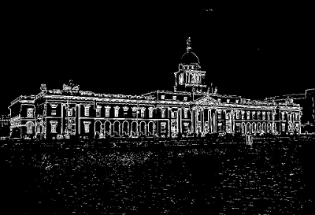

 

An image processing library for learning purpose in C++17.

| Build status (GCC) | [](https://travis-ci.org/PlathC/Mirage)                                     |

| Code quality       | [](https://www.codacy.com/manual/PlathC/Mirage?utm_source=github.com&amp;utm_medium=referral&amp;utm_content=PlathC/Mirage&amp;utm_campaign=Badge_Grade) 

<h2 align="center">The library</h2>

### __Tasks__

__Library features__

| Feature           | Progress                                                     |
|-------------------|--------------------------------------------------------------|
| Image structure   | Done                                                         |
| Parser            | Done (PNG/JPEG)                                              |
| Mirage Viewer     | In dev                                                       |

__Image processing features__ 

| Feature                          | Progress             |
|----------------------------------|----------------------|
| Image structure                  | Done                 |
| Bit depth / Pixel type           | To do                |
| DFT                              | To do                |
| Filter                           | Done                 |
| Sobel / Threshold                | Done                 |
| Histogram Equalization           | Done                 |
| Adaptive Histogram Equalization  | To do                |
| Canny                            | Done                 |
| Crop / Scale                     | Done (RT to do)      |
| Video support                    | To do                |
| Optimization (Realtime use)      | To do                |
| Test (Catch2)                    | In dev               |

<h2 align="center">Build</h2>

### Dependencies 

*   LibPng
*   LibJpeg-turbo
*   Qt5
 
### Compiler

This project has been tested with MinGW and MSVC (VS2017).

<h2 align="center">Examples</h2>

#### __Filter__ 

One can use the Convolve function to filter an image with a kernel.

The following example show how to apply a Gaussian Blur to an image using 
a kernel provide in the library.

##### Filter Results 

  

#### __Edges detection__

The library provides Canny and Sobel algorithm which allow to extract 
contour lines within m_a given image.

##### Edges detection Results

Original : 

 

Canny :


Sobel :

 

#### __Histogram Equalization__

The library provide an histogram equalization function for grayscale and 
color image.

##### Histogram Equalization Results 

  

  

### __Viewer__

A viewer is implemented in order to provide an easy way to test each features with a
 visualization tool.
 
```cpp
#include <QApplication>

#include <Mirage/Mirage.hpp>
#include <Mirage/Viewer/Viewer.hpp>

int main(int argc, char** argv)
{
    QApplication app{argc, argv};

    mrg::Viewer viewer = mrg::Viewer([](mrg::Matrix<uint16_t> img) -> mrg::Matrix<uint16_t>
        {
            auto raw = mrg::Canny(img);
            return mrg::Matrix<uint16_t>(raw.DataInType<uint16_t>(), raw.Width(), raw.Height(), 1);
        }
    );
    viewer.show();

    return app.exec();
}
```
