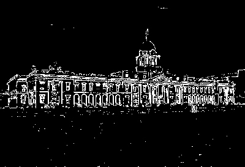
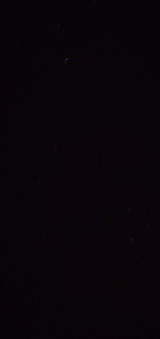
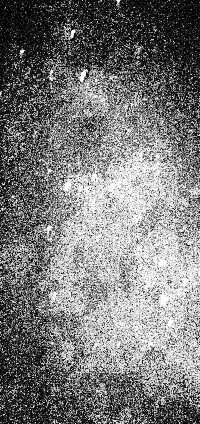

<h1 align="center">Mirage</h1> 

An image processing library for learning purpose in C++17.

Build status (GCC/Linux) : [](https://travis-ci.org/PlathC/Mirage)

<h2 align="center">The library</h2>

### __Tasks__

__Library features__

| Feature           | Progress |
|-------------------|----------|
| Image structure   | Done |
| Parser            | Done (PNG/JPEG) |
| Viewer            | In Progress (Vec4ui image only and distortion of the image.) |

__Image processing features__ 

| Feature                          | Progress |
|----------------------------------|----------|
| Image structure                  | Done |
| Bit depth                        | To do |
| DFT                              | To do |
| Filter                           | Done |
| Sobel / Threshold                | Done |
| Histogram Equalization           | Done |
| Adaptive Histogram Equalization  | To do |
| Canny                            | Done |
| Scale/Transform/Rotate           | To Do |

<h2 align="center">Build</h2>

### Dependencies 
    
- LibPng
- LibJpeg-turbo
- Vulkan (Image viewer)
- GLM
- GLFW3
 
### CMake

This project needs CMake to be built. 

### Compiler

This project has been tested with MinGW and MSVC (VS2017).

<h2 align="center">Examples</h2>

#### __Filter__ 

One can use the Convolve function to filter an image with a kernel.

The following example show how to apply a Gaussian Blur to an image using 
a kernel provide in the library.

```cpp
#include "Mirage/Mirage.hpp"

int main()
{
    using namespace mrg;

    Matrix<Vec4d> mat = ImageParser::FromFile<Vec4d>("../samples/rubberwhale.png", 4);
    Matrix<Vec4d> matConvolve = mat.Convolve(mrg::gaussianBlurKernel5x5);
    ImageParser::ToFile(matConvolve, "../examples/filter/Results/rubberwhale-convolve.png");

    return EXIT_SUCCESS;
}
```

__Results :__

  

#### __Edges detection__

The library provides Canny and Sobel algorithm which allow to extract 
contour lines within a given image.

```cpp
#include "Mirage/Mirage.hpp"

int main()
{
    using namespace mrg;

    Matrix<Vec4d> mat = ImageParser::FromFile<Vec4d>("../samples/HouseDublin.jpg", 4);

    Timer sobelTimer{}, cannyTimer{};

    sobelTimer.Start();
    Matrix<double> matSobel = mat.Sobel().Threshold<double>();
    sobelTimer.Stop();

    cannyTimer.Start();
    Matrix<double> matCanny = mat.Canny();
    cannyTimer.Stop();

    std::cout << "Sobel compute time : " << sobelTimer.Duration() << std::endl;
    std::cout << "Canny compute time : " << cannyTimer.Duration() << std::endl;

    ImageParser::ToFile(matSobel, "../examples/edgedetection/Results/HouseDublin-Sobel.png");
    ImageParser::ToFile(matCanny, "../examples/edgedetection/Results/HouseDublin-Canny.png");

    return EXIT_SUCCESS;
}
```

__Results :__ 

Original : 

 

Canny :



Sobel :

 

### Histogram Equalization

The library provide an histogram equalization function for grayscale and 
color image.

```cpp
#include "Mirage/Mirage.hpp"

int main()
{
    using namespace mrg;

    Matrix<Vec4d> mat = ImageParser::FromFile<Vec4d>("../samples/lena.png", 4);
    Timer timer{};

    timer.Start();
    Matrix<double> matGrayScale = mat.ToGrayScale<double>();
    Matrix<double> matEq = matGrayScale.HistogramEqualization();
    timer.Stop();

    std::cout << "Duration : " << timer.Duration() << std::endl;

    ImageParser::ToFile(matEq, "../examples/histeq/Results/lena-eq.png");

    return EXIT_SUCCESS;
}
```


__Results :__ 

  

  

  

### __Viewer__

The viewer can be used as follow :

```cpp
#include <Mirage/Mirage.hpp>
#include <Mirage/Viewer/Viewer.hpp>

int main()
{
    using namespace mrg;
    Matrix<Vec4ui8> mat = ImageParser::FromFile<Vec4ui8>("../samples/tiled4x3.png", 4);
    Viewer viewer = Viewer(800,800, mat);
    try{
        viewer.Show();
    }catch(std::exception& e)
    {
        std::cerr << e.what() << std::endl;
        return EXIT_FAILURE;
    }

    return EXIT_SUCCESS;
}
```

__Results :__

